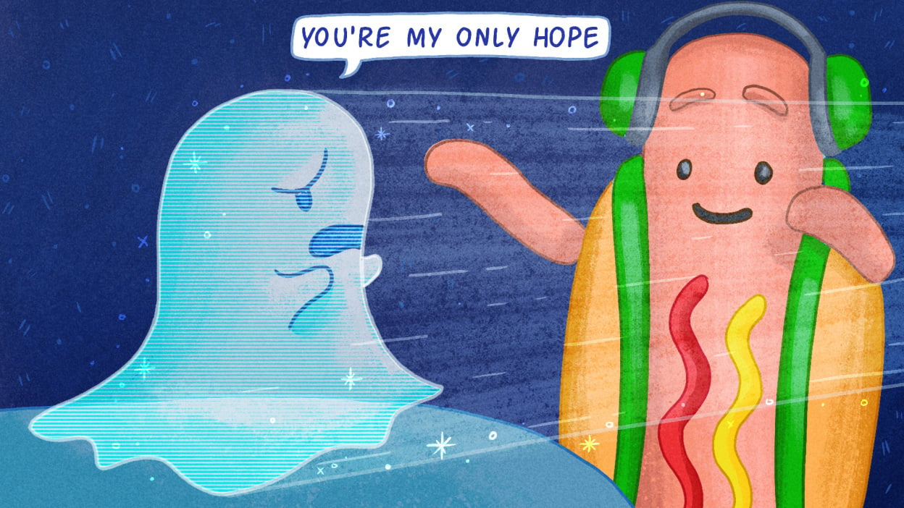
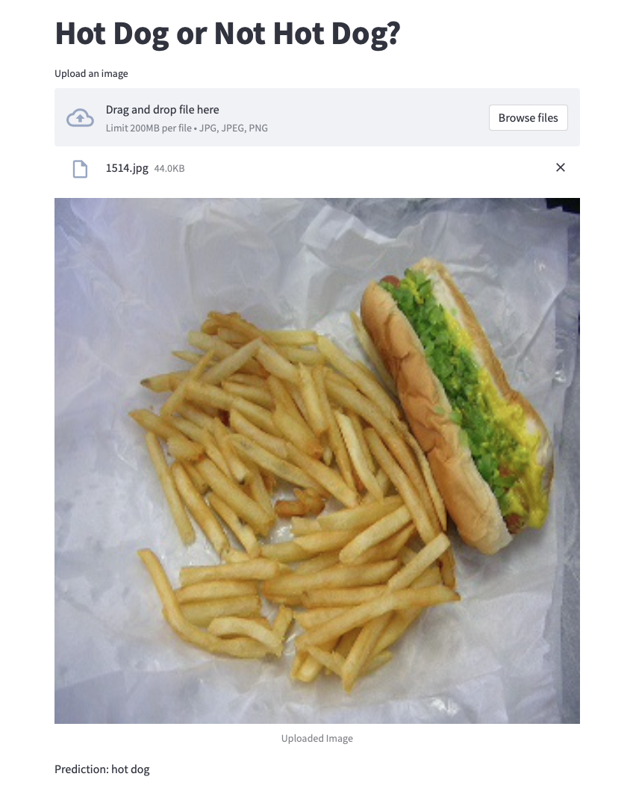
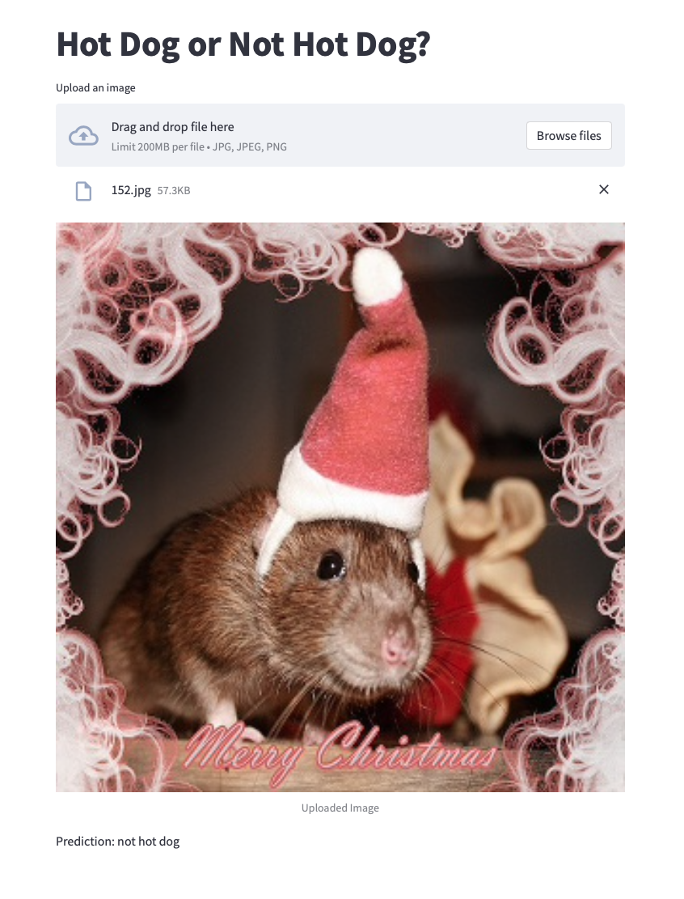
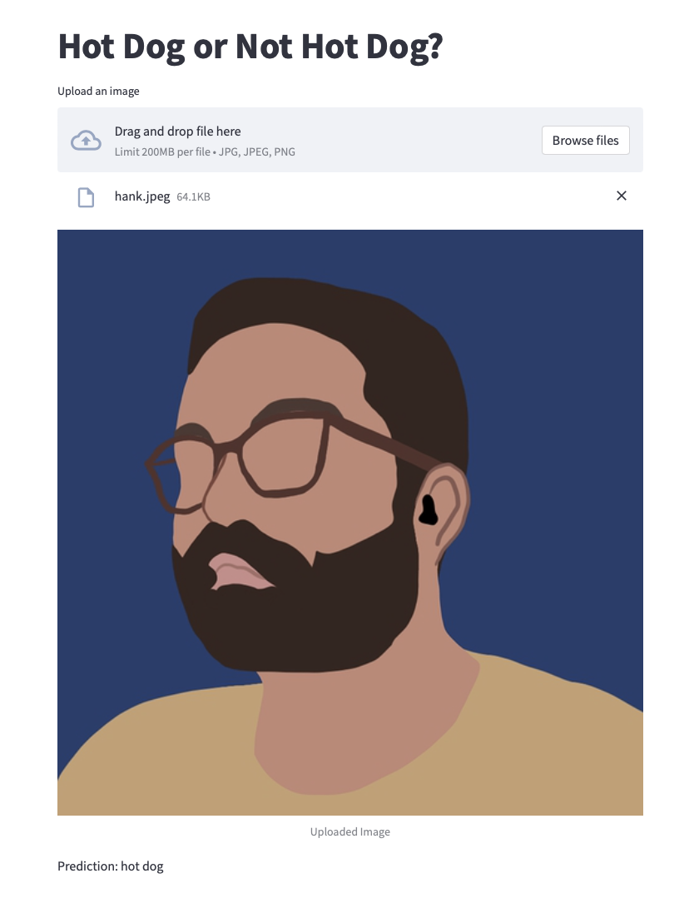
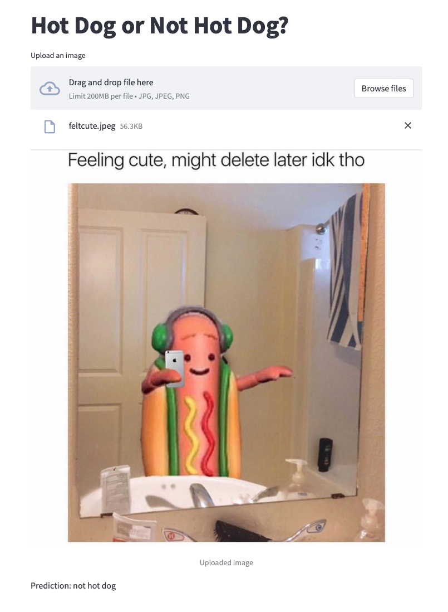

#  READ ME: Hot dog?

### Contents:
- [Introduction](#Introduction)
- [Problem Statement](#Problem-Statement)
- [Data](#Data)
- [Methods](#Methods)
- [Outcome](#Outcome) 
- [Examples](#Examples) 

## Introduction

"SeeFood". It's Shazam for food. 

## Problem Statement

**Can I create an app that utilizes a neural network to predict if an image contains a hot dog without having a meltdown over hot dogs before 2pm PST?** 

## Data 
[Dataset from Kaggle](https://www.kaggle.com/yashvrdnjain/hotdognothotdog#__sid=js0).

The data used for this model orginated from a Kaggle dataset that contains train and test folders with 'hot dog' and 'not hot dog' images. 

## Methods 

A Convolutional Neural Network was built and fit on the training images and tested with the testing images. 

Streamlit was used to create an app for the model to be showcased, allowing users to upload images for the model to predict if the images are or are not a hot dog. 

## Outcome

The CNN model works better than the baseline, predicting roughly 20% more accurately than baseline. The baseline was 50%, whereas the CNN model predicted with over 70% accuracy. 

The app can be run by downloading this repo and running `streamlit run hotdog.py` in your terminal. 

## Examples

### Correctly Predicted Hot Dog 🌭

Image sourced from test set

### Correctly Predicted Not Hot Dog 🐹

Image sourced from test set

### Incorrectly Predicted Hot Dog 🤨
 
Image sourced from Slack

### Sadly, Snapchat's Dancing Hot Dog is Not Given Proper Recognition 😔

Image sourced from [here](https://i.insider.com/5964ffddd9fccdb1278b5739?width=1000&format=jpeg&auto=webp) 

